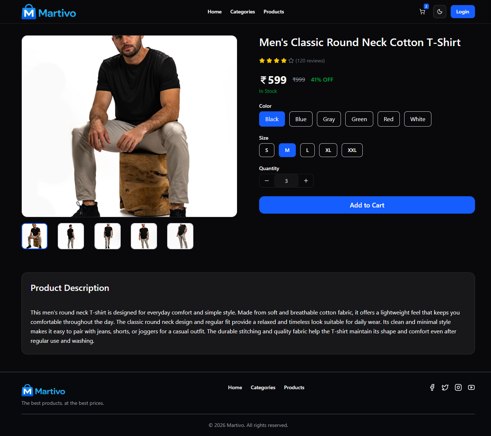
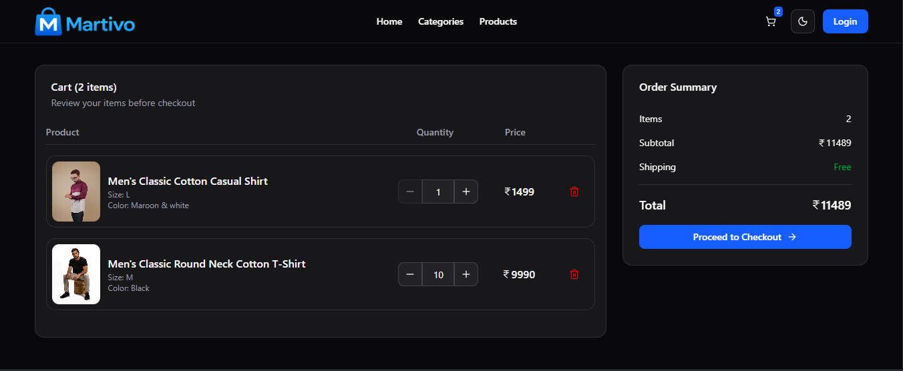
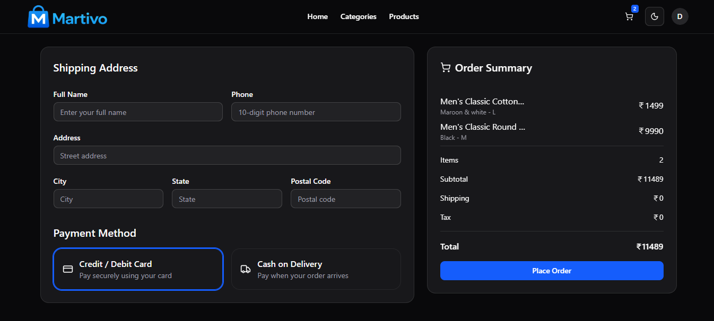
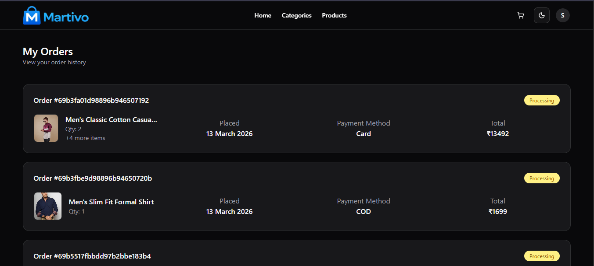
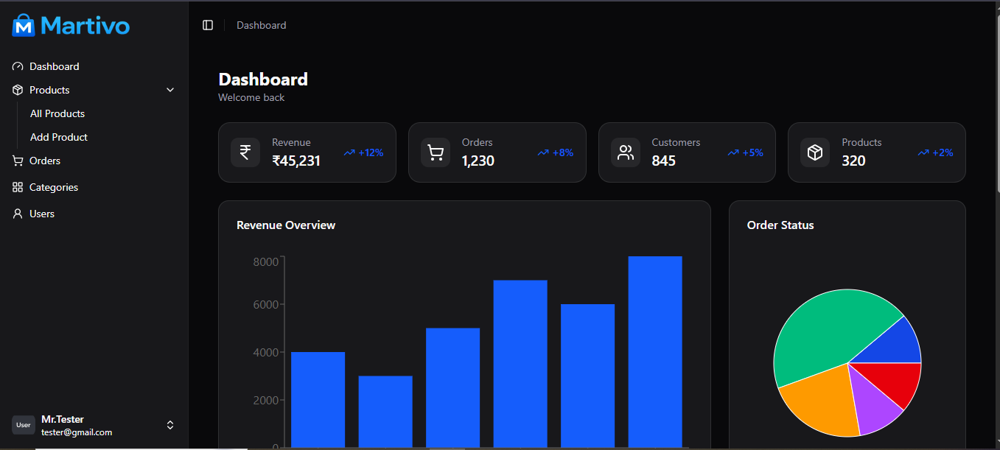

# 🛒 Martivo – MERN E-commerce Application

## 🚀 Overview

Martivo is a full-stack e-commerce application built using the MERN stack.  
It provides a seamless shopping experience for users along with a powerful admin dashboard for managing products, variants, and orders.

The project demonstrates real-world e-commerce functionality including authentication, product management, cart system, and order processing.

---

## 🔗 Live Demo

https://martivo-seven.vercel.app/

---

## 👤 Demo User

Use the following credentials to explore the application:

- **Email:** demo@test.com
- **Password:** 123456789

---

## 🛠 Tech Stack

### Frontend

- React.js
- Context API
- CSS / Tailwind

### Backend

- Node.js
- Express.js

### Database

- MongoDB Atlas

### Authentication

- JWT (JSON Web Tokens)

### Deployment

- Frontend: Vercel
- Backend: Render

---

## ✨ Features

### 🛍 User Features

- User authentication (Signup / Login)
- Browse products with category filtering
- View detailed product pages
- Product variants (size, color, pricing)
- Add to cart with persistent storage (LocalStorage)
- Checkout system with order creation
- Order history tracking

---

### 🛠 Admin Features

- Add, edit, and delete products and categories
- Manage product variants (size, color, stock)
- View all users and orders
- Update order status (Pending → Shipped → Delivered)
- Inventory management

---

## 📸 Screenshots

### Home Page

### Product Page

### Cart

### Checkout

### Orders

### Admin Dashboard

---

## 🏗 Architecture

The application follows a typical client-server architecture:

- **Frontend:** React application handling UI and state management
- **Backend:** RESTful API built with Node.js and Express
- **Database:** MongoDB for storing users, products, variants, and orders

### Data Flow:

1. User interacts with frontend
2. Frontend sends API requests to backend
3. Backend processes logic and interacts with database
4. Response is sent back to frontend

---

## ⚙️ Installation & Setup

### 1. Clone the repository

git clone https://github.com/sandeepcodelab/martivo.git

cd martivo

### 2. Setup Backend

cd backend

npm install

npm run dev

### 3. Setup Frontend

cd frontend

npm install

npm run dev
